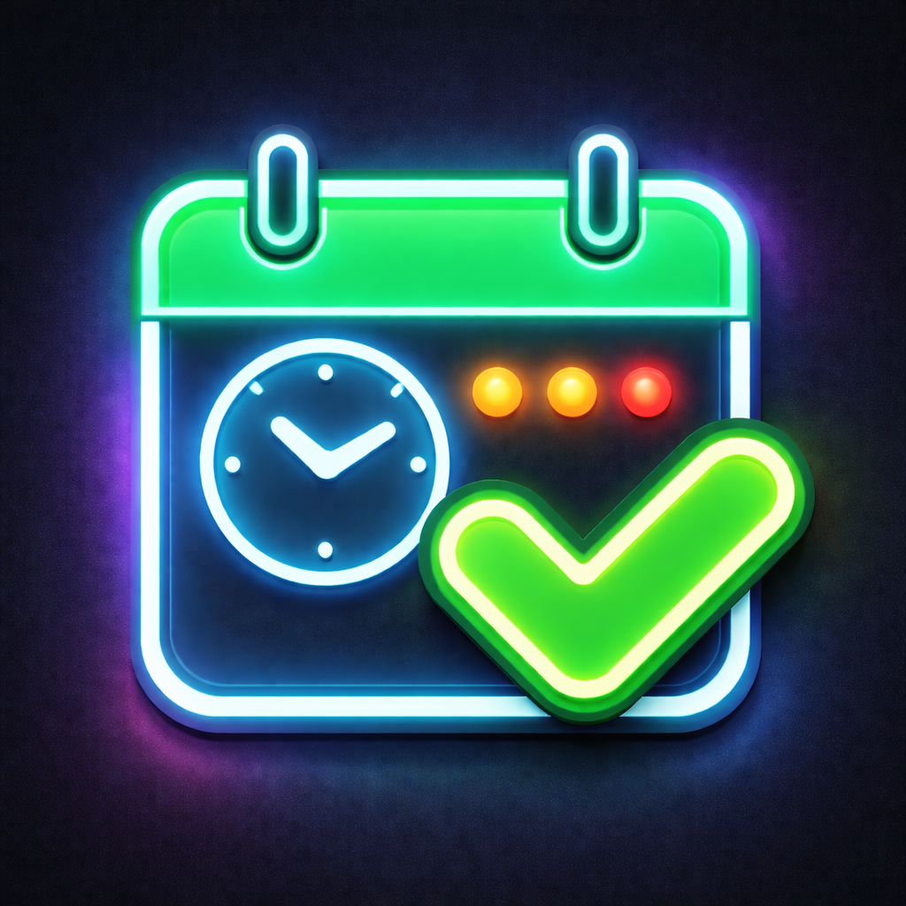

# Last Time

<p align="center">
  
</p>

A simple browser app for tracking the last time you did recurring life tasks. Last Time is useful for things that do not need a calendar event, but are easy to forget: changing sheets, washing towels, cleaning the fridge, backing up files, replacing a toothbrush, or checking subscriptions.

## Features

- Tracks recurring tasks with a last-done date.
- Shows how many days have passed since each task was last completed.
- Supports optional target intervals in days.
- Sorts tracked items by urgency.
- Uses color-coded cards to show whether something is fresh, approaching due, or overdue.
- Lets you mark a task as done today with one click.
- Includes an edit modal for renaming, changing target days, updating dates, or deleting items.
- Stores data locally in the browser with `localStorage`.
- Supports JSON export and import for manual backups.
- Runs entirely client-side with no dependencies, build step, or backend.

## Default Trackers

The app starts with a generic set of common trackers, including:

- Change bed sheets
- Wash towels
- Clean the bathroom
- Mop or vacuum floors
- Clean the fridge
- Wash jeans
- Replace toothbrush
- Back up important files
- Review subscriptions
- Call family or a close friend

These are only starter examples. Users can edit, delete, import, export, or add their own trackers.

## Tech Stack

- HTML
- CSS
- JavaScript

## Running Locally

Clone the repository and open `index.html` in a browser:

```bash
git clone https://github.com/MarcosGibert/Last-time.git
cd Last-time
open index.html
```

You can also serve the folder locally:

```bash
python3 -m http.server 8000
```

Then visit `http://localhost:8000`.

## How It Works

Each tracker has a name, a last-done date, and an optional target interval. The app calculates the number of days since the last-done date, compares it with the target interval, and uses that ratio to sort and color the cards.

Data stays on the user's device unless they manually export it.

## Project Context

This project was built as a lightweight personal utility for remembering irregular maintenance tasks without turning them into formal calendar reminders. It focuses on fast capture, low friction, and local-first data storage.

## Limitations

- Data is stored only in the current browser unless exported manually.
- There is no account sync or cloud backup.
- Import/export is JSON-based and intended for manual backups.
- The app does not currently support recurring notifications.

## Possible Improvements

- Add categories such as Home, Health, Clothes, Admin, and Relationships.
- Add search or filters for larger tracker lists.
- Add optional browser notifications for overdue tasks.
- Add a reset-to-defaults action.
